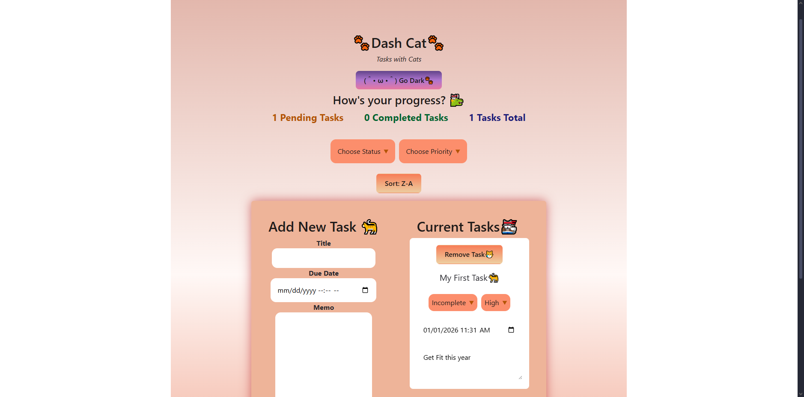
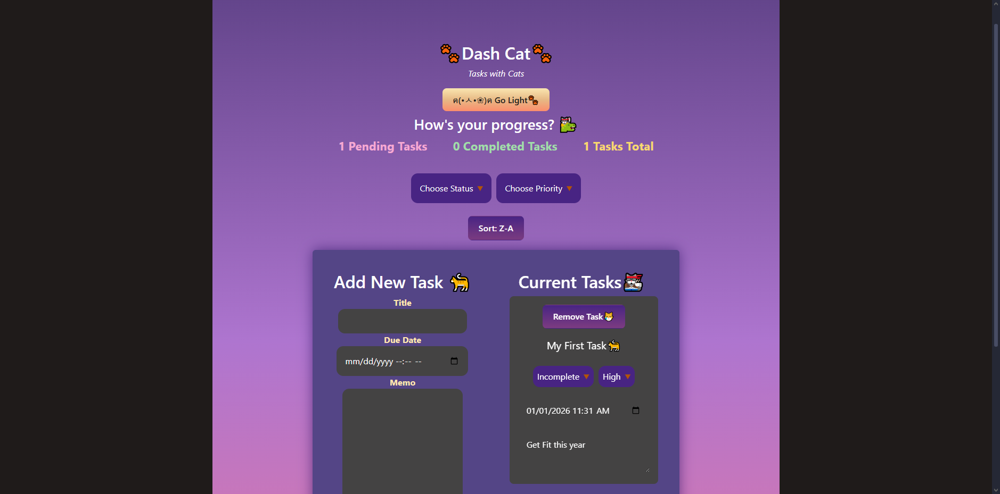
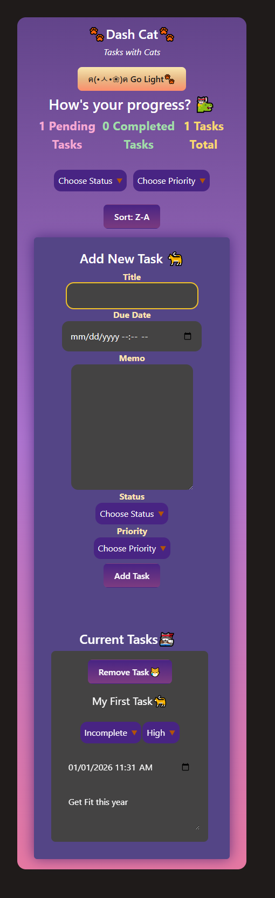

# Task Dashboard: Dash Cat
## Overview
The project test my understanding of React components, state management, TypeScript integration, form handling, and component composition. I was tasked to create a Task Management Dashboard using React and TypeScript.

------------------------------------------------
## Table of contents

- [Overview](#overview)
  - [GitHub](#github)
  - [Usage](#usage)
  - [Link to Website](#view-live-website)
  - [Previews](#previews)
  - [My process](#my-process)
  - [Built with](#built-with)
  - [Reflection Questions](#reflection-questions)
  - [Useful resources](#useful-resources)
- [Author](#author)

### GitHub Link
https://github.com/ANIO-Official/task-dashboard

### Usage
1.  Clone the repository or Download the ZIP file and extract the files.
2.  Open the file in Visual Studio Code.
3.  Open the Terminal using Ctrl + ~
4.  cd into the directory 'task-dashboard' in the terminal.
5.  Run the project using "npm run dev" in the terminal.
6.  You should see 3 options appear. Follow the link for the Local option. Such as "http://localhost:5173/"

A web app in your default browser will appear with the character counter available for use.

Users should be able to: 

- Create Task
- Read Task
- Update Task
- Delete Task
- See Tasks from previous session via local storage.
- Toggle Dark/Light mode.
- Reorganize Tasks
- Filter Tasks

### Previews
**DESKTOP | LIGHT MODE**

**DESKTOP | DARK MODE**

**MOBILE**

## My process
Brief about my process. Here are my steps:

 1. Initial Variables and states in Dashbaord component.

  - Very bare bones initially but will be built upon throughout the other steps. 
  - Held only state variables, handler functions, and the component composition (for testing and final).

 2. Task Form & Task Item Components

  - I created these two together as they work together to make the tasks that will appear on the task list. 
  - Adjusted props throughout their creation process to meet the needs for their functionality.
  - Tested to ensure the event handlers worked as expected and allowed for user input.

 3. Task List Component, Testing, and Adjustments

  - Using the Task Form, I created Task objects that would then update state. This information would be accessible for the Task Item component, then the task item component would render inside the Task List component.
  - Sent neccessary handler function from parent component Dashboard to it's child component TaskItem.

 4. Style the basic inital parts for visual heirarchy and clarity.

  - Added Bootstrap CDN
  - Added basic styling like borders, colors, padding, and margins using Bootstrap and CSS.

 5. Filter & Search

  - Created a new state variable filteredTasks to hold all task, show filtered tasks, and show sorted tasks.
  - Replaced the tasks prop for TaskList with filteredTasks state variable instead of tasks state variable to ensure display updates.
  - Added JSX to Filter component for selects and buttons with conditional rendering of a span to represent which filter was last active.

 6. Dashboard Component Finishing & TouchUps

  - Added logic for handler functions when state changes for tasks, filter, and filtered tasks.
  - Added Local Storage to store values and update local storage.
  - Added additional JSX for composing components and showing stats for tasks.

 7. Test, BugFix, Adjustments

  - Test the HTML file in the chrome or chromium browser.
  - Fix bugs such as visual errors with CSS and dynamic elements.

 8. Touch ups: Style, Form Validation, & Responsiveness

  - Overall styling adjustments. Added Cat Emoji & Kaomoji for theme.
  - Adjustments to include tablet sized device responsive layout.
  - Check and adjust mobile layout to fix any visual bugs.
  - Added form validation to TaskForm

 9. Dark mode toggle

  - Create CSS .dark class styling for applicable areas.
  - Create state variable to control darkmode toggle and use conditional JSX rendering to add and remove '.dark' class for theme switching.
  - Made adjustments to various element CSS for smoother darkmode transition.

### Built with
- REACT
- JSX
- Vue
- TypeScript
- Bootstrap
- CSS

## Reflection
 **Implementing React & Typescript Features**

  I created my project using 'npm create vite@latest'. Chose React, Typescript + SWC. Named my project, changed directories to my folder, and installed npm for my project. Immediately after, I 'npm run dev' so that I can view my project as I work. This takes up my initial terminal, so I like to open a second terminal for specifically git commits and pushes.

  As for implementing React, I created component function inside of my src folder within my component folder. I declared neccessary variables and functions, such as event handler functions, at the top level of the component function. Additionally, I passed the props neccessary for altering the data per component. For example, the TaskForm component makes tasks objects **and** creates a form via JSX to collect the data for the objects. This meant, I needed to pass a prop for the tasks state variable to hold the objects made upon submitting my form, and to add those objects I needed to pass a prop for the tasks setter function setTasks.

  For TypeScript, I created an index file to hold all types and object shapes (interfaces). I then imported these types to ensure props, variables, and functions return or input the correct information depending on context. This is especially helpful for destructing the props for components and typing the destructured object by the corresponding interface. Typescript reminded me constantly of which properties were missing in my props, variables, or function parameters.
 
 **Challenges faced**

  It took a very long time for me to comprehend how to properly render the tasks after filtering. I ran into the issue of being able to filter the tasks but they wouldn't appear. I also faced a challenge where the keys were matching due to using an inline JSX function.
 
 **Solutions implemented**

  To fix the filtered tasks, I listened back to what my peers explained in class. Additionally, I took some time to study and watch videos that broke down the understanding of filtering list and how to intergrate keys into the process. I took time to follow along with a simpler example as well and recreated it in a smaller project file. Doing these practices helped me better understand handling lists in React. So upon returning to the project, I was able to properly filter and display the tasks.

  Particularly my solution was to initialize the tasks state varible with local storage as its value, then set the filtered tasks state variable to a spread value of the tasks state variable variable. I also replaced the tasks prop of all applicable components with the filtered task state variable instead of the tasks state variable such as the TasksList. This ensured the original tasks data could still be modified and used to update the filtered tasks without losing any data due to modifying the tasks objects directly. I could display all tasks at any time using the [...task] shallow array and filter data as well this way.

  Regarding the matching key issue, I fixed it by add an id property to the task objects first. Then performing that same inline JSX function to create the unique string for the id's value. I then set the key for each list to their id. Error no longer occured. 
 

**Component Composition & State Management**

  For comoponent composition, I arranged composnents based on who they would need to communicate with via props. One particular thing I did to aid this process, was to first go into my dashboard component and type out comments that explain where and what communications needed to occur. Ultimately the flow followed this structure:
  
  (PARENT:  Dashboard Component)

  (CHILD TO DASHBOARD: Task Filter, Task List, and Task Form Components)

  (CHILD TO TASK LIST: Task Item Component)

  For State management, I placed state variables at the top level of their respective components. For state variables that would need to be passed to most children, such as the tasks, filter tasks, and state setter functions, I kept them in the Dashboard parent component. If a child's child needed that same information, I passed the state variable from parent -> child --> child's child. So that when an update occured, it could flow back to the main parent via child --> parent --> parent's parent. In summary, I used the callback patten for updates to state; Generational. 

### Useful resources

--------------------------------------------------------

**GENERALLY HELPFUL DURING CODING PROCESS**

[Component Library | Re-referenced for Syntax](https://github.com/ANIO-Official/component-library)

[Your Blog Script | Filtering, Deleting, Form Validation Vanilla JS Method](https://github.com/ANIO-Official/your-blog-journaling-app/blob/main/script.js#L182)

[The Coding Loft | Sort & Filter using React & TypeScript](https://youtu.be/2iEfZWz1jvs?si=KXmw4k4AEwa2ui43)

[QiroLab | React List & Keys](https://youtu.be/UUk1scVLrCQ?si=A_0iiyUq_CRhsFIT)

[Nova Designs | Just the UseState Part](https://youtu.be/43H_PNDPHtg?si=8toFRHnZY4dF7XNn)

[Devtamin | Lists and Map in React](https://youtu.be/qb8dT978Wec?si=JKE2PMqy_9rfQVz2)

[Codevolution | List & Keys  (Older but great Conceptually!)](https://youtu.be/0sasRxl35_8?si=EyzT6P-Hb3tjpW6o)

[Stack OVerflow | Change Parent CSS based on Child](https://stackoverflow.com/questions/2326499/apply-css-styles-to-an-element-depending-on-its-child-elements)

**MDN SPECIFIC**

[MDN DateTime-Local](https://developer.mozilla.org/en-US/docs/Web/HTML/Reference/Elements/input/datetime-local)

[MDN Current Target | (Very good when TS doesn't like event.target)](https://developer.mozilla.org/en-US/docs/Web/API/Event/currentTarget)

[MDN Custom Select](https://developer.mozilla.org/en-US/docs/Learn_web_development/Extensions/Forms/Customizable_select)

[MDN Custom Select Play | Sandbox](https://developer.mozilla.org/en-US/play?uuid=6bf9cd93e148f955ed82aa7d7aa0924abe7dd534&state=tVbBbuM2EP2VAYMFktaK7WBRpFzHaNGi2GOBveoyJkcW1xRJkHRi7yKfULQFeuhtv6GXov2d%2FkD7CQVFSZGTbLYOUAGGLfK9maeZx5Hfszo2mnG2qKxvlqUBWLj2C2ChcUUaKuuvSuYoFoE0iViy5Zv2BziKfDFtUT0lQ0DJ%2B5S8D7BYbWO0ZrgfOCSFNZFMXC6m91cG8nRgD0vWRWUNXKPe0lXJSrb8XhMGgk4KJpmLaYYtP0YTOBaZRDk0IDSGcFUyJawpGaBXWNRKSjJXJYt%2BSyVb%2FvPhp98W0wS%2FYy8P6TlX0RaqZMtvMGbC6Lk%2BIU%2Fa9fPl%2FX6cvG%2Ft%2Blh5NTYhkn%2B%2BxD%2BPk%2Fg65ztWpqiV2JB5vsxfjmx0zneszEqF%2BvkaPxyn8TsV6mMFBoMber7CH45T%2BCZle1piPzHy%2FJqmAbaYdgONTZgIgXGWIZPScO5SX%2FxpXjmD94mGzhF6NII4rDBQN7pelea2NJ9lzMruiqDeKbPmsLJeki9WdpchpUmTNOMqa2JRYaP0nkPJXpO%2BpqgElmwCJfvaK9TpZ0ATikBeVX2IlZX7HOJGyVhzmM9mL16le4dStnlnMJ%2B5XbvW4K7ocC8v7xb9WpmEw220g7aLkbKg3hGH%2BfmFp6YHuLwvVXAa9xwqTTneGh3vU7bI%2FFYYi6xULLpR3VJQq7VJ9as4CDKRfM%2FtZnKWomnHYZ63xhu5shwu3A6C1UrCiWyvNvgKxWbt7dZIDifUXocFGsoTPZqgkk04zM5fhkMRvLbX5CfDbWXFNnQCximG1IPK3j9F8nlmCKut53DyZXs9mh28jRjpIJB1ZB6JlpEc5pczSevMeNy0famMNV3k7qh%2BpJlvtyGqat93K%2B8UIaKPd82%2ByAX8%2F1uRtfJK%2BRALWxVx72j8XIVHqbaBw6XbtZ8ZzPomdlyNn6DOYNbTe%2BpTpRynvJfK2Hj6SNZD%2BsrGaJuHDeEm1j3j1Ep59tBpN7Xq7TGweo%2F2lXrco05vm4Pun9956eDAf5EPPECkXUyji0P0qkmqaxDoALWrcZVm1dinwx%2BxceDBXA8eVdQkNiRH%2BW9IreuYZqaWB9CMbdBvMrqz23w0yQpNVeT9MEtHrbNuyf769ee%2F%2F%2FixZE%2BdEOtQqLjnrXMOjYha55OJWtubQqogPPUtuB%2BNO%2BtSM4p0Zu%2BF7mbYV%2B05UmZdhLjXnR3%2FQ5wHIm%2BfeJ5oHQeBWpyiEbX1p9lxZ%2FA5zN3urOV3Fcv789mLs6yPTdjb9CJkExZraohxJtFv2O2%2F&srcPrefix=%2Fen-US%2Fdocs%2FLearn_web_development%2FExtensions%2FForms%2FCustomizable_select%2F)

--------------------------------------------------------

**PER SCHOLAS**
My peer Javon showcased his handling of the filtered tasks from a previous lab which helped confirm and shed some light about how to go about creating and using the filtered task objects. I was unsure if it would be best to use them directly or if I needed to send their values back to the tasks state variable. His explaination helped me realize it was much better to use the filtered tasks directly.

Our IA Bryan Santos, additionally helped with his provided filtering example created during office hours. I was able to examine his code and breakdown the logic behind the steps of his process. 

For additional clarity on filtering, I also turned to my peer Andrea for her example from the previous lab and explaination shared to her from Bryan as well.

PerScholas Lesson 9.4 & 9.8 helped me most when going back to reunderstand concepts.

## Author [Amanda Ogletree](https://www.linkedin.com/in/amanda-ogletree-a61b60168)
